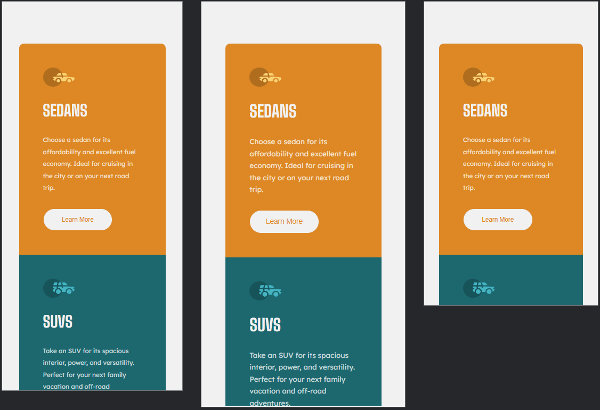
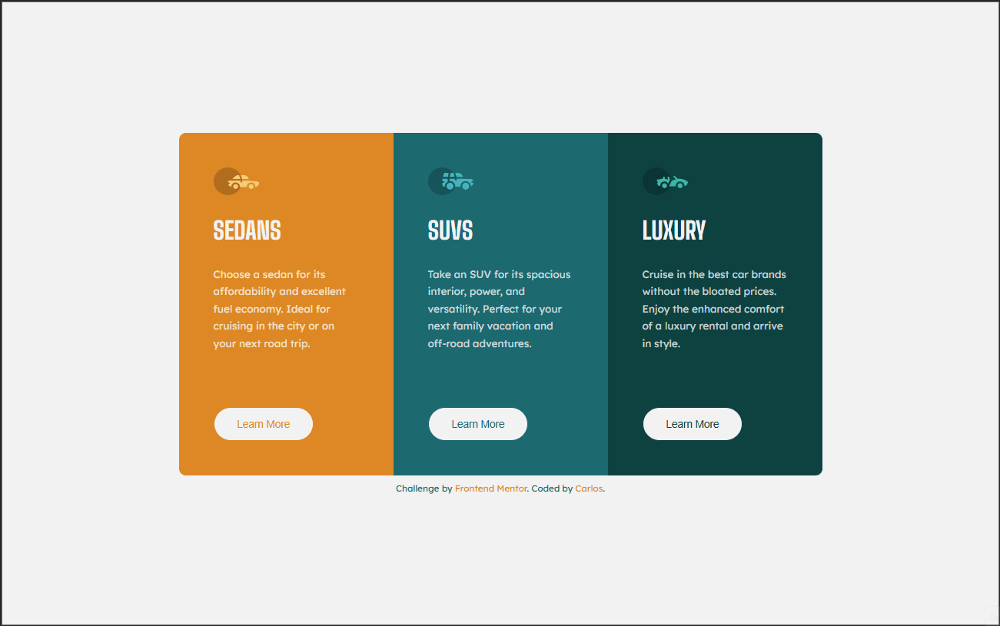

# Frontend Mentor - 3-column preview card component solution

Esta é a minha solução para o desafio <a href="https://www.frontendmentor.io/challenges/3column-preview-card-component-pH92eAR2-" target="_blank" rel="noopener noreferrer">“3-column Preview Card Component”</a> do **Frontend Mentor**. O objetivo é a construção de um layout responsivo com três colunas, cada uma representando uma categoria de produto ou serviço (neste caso, tipos de veículos: Sedan, SUV e Luxury).

## Índice

- [🔍 Visão Geral](#visão-geral)
  - [🎯 O desafio](#o-desafio)
  - [📸 Screenshots](#-screenshots)
  - [🔗 Links](#links)
- [⚙️ Meu processo](#meu-processo)
  - [🛠️ Tecnologias Utilizadas](#tecnologias-utilizadas)
  - [📚 O que aprendi](#o-que-aprendi)
- [👨‍💻 Autor](#autor)
-[📝 Licença](#-licença)
- [🙌 Agradecimentos](#agradecimentos)

## 🔍 Visão Geral

### 🎯 O desafio

Os usuários devem ser capazes de:

- Visualizar o layout ideal conforme o tamanho da tela do dispositivo
- Ver estados de hover para elementos interativos

### 📸 Screenshots

| 📱 Versão Mobile | 💻 Versão Desktop |
|------------------|-------------------|
|  |  |

### 🔗 Links

- 🔧 URL da solução: <a href="https://github.com/slayer-br/three-column-card.git" target="_blank" rel="noopener noreferrer">3-column Preview Card Component</a>  
- 🌐 URL do site ao vivo: <a href="https://slayer-br.github.io/three-column-card" target="_blank" rel="noopener noreferrer">3-column Preview Card Component</a>

## ⚙️ Meu processo

### 🛠️ Tecnologias Utilizadas

- **HTML5 semântico**
- **CSS3 customizado**  
- **Flexbox**
- **CSS Grid**  
- **Mobile-first**  
- **Google Fonts** (Lexend Deca, Big Shoulders)

### 📚 O que aprendi

Durante este projeto, pratiquei a criação de um layout responsivo utilizando CSS Grid e Flexbox. Aprendi a usar variáveis CSS para gerenciar cores e fontes de forma consistente em todo o projeto. Também melhorei meu conhecimento sobre acessibilidade criando botões com estados de hover e foco.

Exemplo de trecho CSS do qual me orgulho:

```css
.learn-btn {
  transition: all 0.3s ease;
  cursor: pointer;
}

.learn-btn:hover,
.learn-btn:focus-visible {
  background-color: transparent;
  border-color: var(--light-gray);
  color: var(--light-gray);
  outline: 1px solid currentColor;
}
```

## 👨‍💻 Autor

- GitHub - <a href="https://github.com/slayer-br" target="_blank" rel="noopener noreferrer">@slayer-br</a>
- Frontend Mentor - <a href="https://www.frontendmentor.io/profile/slayer-br" target="_blank" rel="noopener noreferrer">@slayer-br</a>

## 📝 Licença

Este projeto está sob a licença [MIT](LICENSE), sinta-se livre para usar e modificar.

## 🙌 Agradecimentos

Agradeço ao time do **Frontend Mentor** pelo desafio e à comunidade pelos feedbacks construtivos que sempre ajudam a melhorar o código e a acessibilidade.